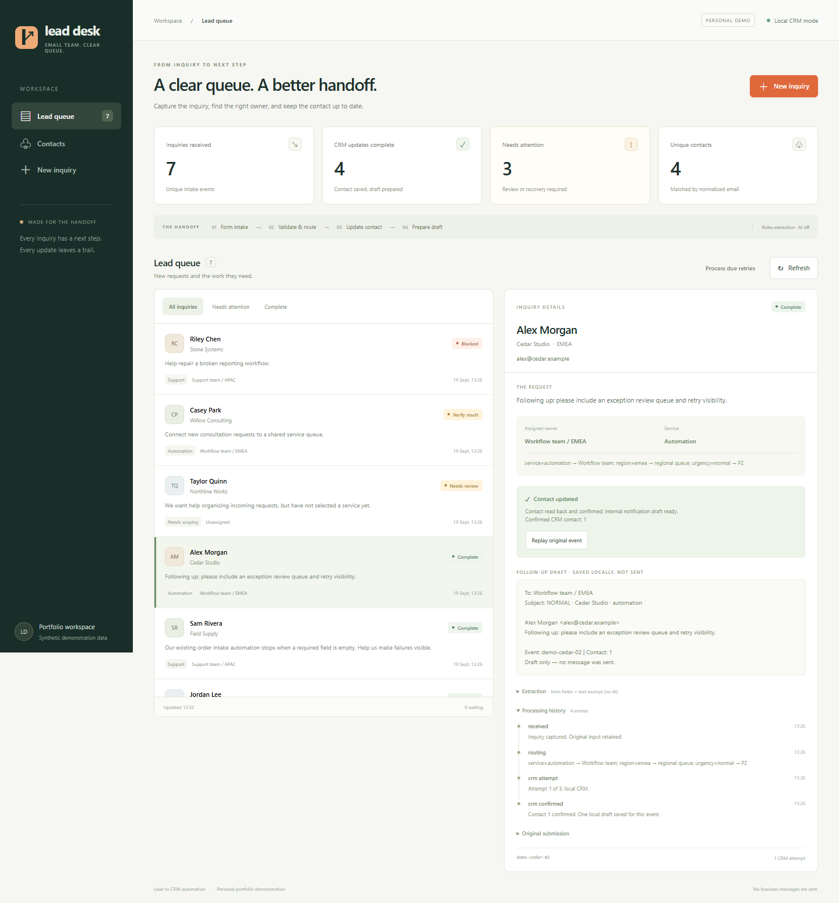

# Practical tools for everyday operations

[English](README.md) · [简体中文](README.zh-CN.md)

I build small applications that help teams organize incoming work, check the results, and handle exceptions.

## Explore by the problem you need to solve

| Your team needs to… | Project | The useful output |
| --- | --- | --- |
| Organize inquiries without duplicate contacts | [Lead-to-CRM Automation](https://github.com/myp81607-dot/lead-to-crm-automation) | An assigned, traceable inquiry and a contact update |
| Turn invoice PDFs into checked spreadsheet rows | [PDF Invoice Reviewer](https://github.com/myp81607-dot/pdf-invoice-reviewer) | Reviewed records with source evidence and CSV export |
| Find a support policy and verify its source | [Support Assistant with Citations](https://github.com/myp81607-dot/support-assistant-with-citations) | Versioned document excerpts or a trackable human handoff |

**Personal demonstration projects using synthetic business data. Not paid client work.** All three run locally; each repository includes English and Chinese instructions, real screenshots, reproducible checks, failure cases, and references.

## Lead-to-CRM Automation

**Problem:** An inquiry arrives, but contact details, ownership, and follow-up get scattered.

**Workflow:** Form → validation → explicit assignment rules → contact update or human review.

The implementation separates duplicate deliveries from new inquiries by the same person. A timed-out write stays unresolved until a read-back check confirms it. Python, SQLite, an English review UI, and an n8n workflow export make the steps inspectable.

**Verified scope:** Local CRM and notification drafts. Live HubSpot and AI are unverified; the n8n export is structurally checked, not executed in n8n.

[Run it and inspect duplicate / recovery examples →](https://github.com/myp81607-dot/lead-to-crm-automation#readme)

## PDF Invoice Reviewer

**Problem:** Extracting text from an invoice does not establish that its fields or totals are correct.

**Workflow:** Text PDF → source-linked fields → decimal amount checks → human review → CSV.

The reviewer sees the document beside editable fields. Missing values, conflicting totals, and duplicate invoices need attention before export. Python, PDF text coordinates, SQLite, and a review interface connect extraction to a usable result.

**Verified scope:** Text-based synthetic invoices. Unfamiliar layouts can miss fields and require manual completion. Scanned documents are unsupported; the evaluation reports the failures.

[See extraction, corrections, and export →](https://github.com/myp81607-dot/pdf-invoice-reviewer#readme)

## Support Assistant with Citations

**Problem:** A support agent needs the relevant policy and an honest next step when documents are insufficient.

**Workflow:** Question → lexical retrieval → versioned source excerpts → human review or a local ticket.

The workspace exposes source text, tagged policy disagreements, document revisions, and ticket notes. FastAPI and SQLite support the workflow. The original TF-IDF learning baseline and repository history remain available.

**Verified scope:** Retrieval, quotations, document updates, and human handoff. Default mode calls no model. The optional local model adapter has transport tests; live generation is unverified.

[Inspect the evidence and known retrieval failures →](https://github.com/myp81607-dot/support-assistant-with-citations#readme)

---

For a similar project, a useful starting brief is **one sample input, the desired output, and the exceptions a person needs to review**.
